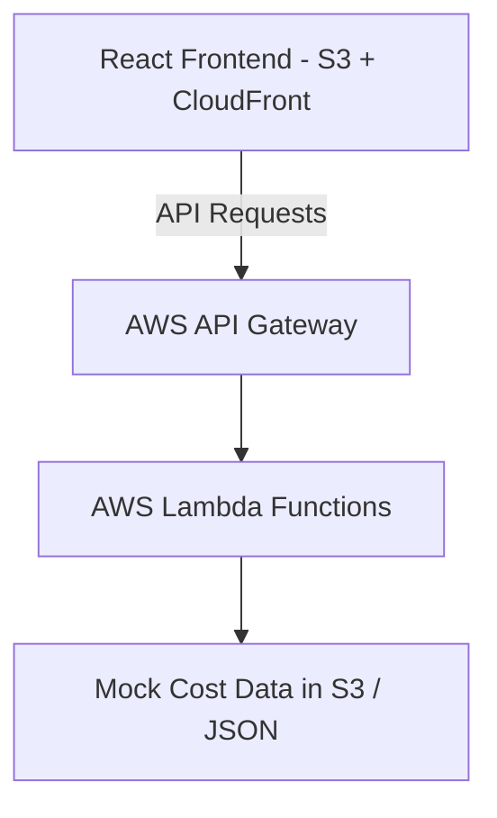

# Cosight

A lightweight, **serverless cost analytics tool** inspired by AWS Cost Explorer — built entirely in the **AWS free tier** using **mocked billing data**.

## Features

* **Interactive Charts** — visualise cost trends & service usage
* **Top Cost Drivers** — see which services are most expensive
* **Date Range Selector** — filter historical or recent cost data
* **Serverless Backend** — no servers to manage or pay for
* **0\$ AWS Bill** — works with mocked billing data to avoid charges
* **Fully Responsive** — works on desktop, tablet, and mobile
* **AWS Hosting** — deployed via S3 + CloudFront for global access

---

## 🛠 Tech Stack

**Frontend:**

* React.js (Vite)
* TailwindCSS
* Chart.js / Recharts

**Backend:**

* AWS Lambda (Node.js)
* AWS API Gateway

**Infrastructure & Hosting:**

* AWS S3 + CloudFront
* AWS CDK for Infrastructure as Code

---

## Architecture



---

## Installation & Setup

1. **Clone the Repository**

```bash
git clone https://github.com/yourusername/aws-cost-insights.git
cd aws-cost-insights
```

2. **Install Frontend**

```bash
cd frontend
npm install
npm run dev
```

3. **Deploy Backend to AWS (Free Tier)**

```bash
cd backend
cdk deploy
```

4. **View in Browser**
   Access via your CloudFront URL or `localhost` for local dev.

---

Screenshots

*(Add your screenshots here once ready)*

---

## Why This Project?

This dashboard is designed to **showcase practical AWS, DevOps, and frontend skills** :

* Demonstrates **microservice separation**
* Uses **modern frontend + cloud hosting**
* Proves **cost-optimization awareness**
* Is **deployable on a \$0 budget**

---

## License

MIT License — feel free to use and modify.


